# Northwind Mutual — Car Quote Generator (CI/CD with Jenkins)

A Java Spring Boot car-insurance quote application, built and quality-gated by a
**self-hosted Jenkins pipeline**: Checkout → Maven build/test → SonarQube analysis +
quality gate → Docker cross-build (ARM64) → Trivy vulnerability scan → push to ACR →
deploy to AKS → smoke check.

> **Disclaimer:** "Northwind Mutual" is a fictional company. All code, infrastructure,
> and data in this project are for personal learning purposes only and do not represent
> or use any real systems, data, or processes from any actual insurance company or
> employer.

---

## What this project demonstrates

Projects 1–3 in this portfolio use Azure DevOps Pipelines, a managed CI/CD service.
This project deliberately uses **Jenkins** instead — a self-hosted CI server you install,
configure, patch, and operate yourself. That's a different skill: instead of trusting a
managed control plane, you're responsible for the controller's plugins, its Docker socket
access, its credentials, and its integration with a second self-hosted tool (SonarQube).

The app itself is a small, honest insurance-domain exercise: driver → vehicle → coverage
choice → calculated premium, with every rating factor visible on the result page rather
than a single opaque number. The interesting engineering is in the pipeline around it —
proving a real build-test-scan-deploy loop works end to end.

### Methodology: manual first, then automate

Every stage in the Jenkinsfile was run by hand first — `./mvnw clean verify` at a
terminal, a manual `docker build`, a manual `trivy image` scan — before it was wired into
Jenkins. That order matters: when a pipeline stage fails, you want to already know what
success looks like from having done it manually, so you can tell a real bug from a CI
environment problem in seconds instead of guessing.

---

## Architecture

### Structural view

Three containers on one Docker network: the app itself, the Jenkins controller, and
SonarQube. Jenkins builds Docker images via **Docker-outside-of-Docker (DooD)** — it
doesn't run its own Docker daemon, it talks to the host's Docker Desktop engine through a
mounted socket. This keeps the whole stack runnable on a laptop with no cloud dependency
until the CD stage.

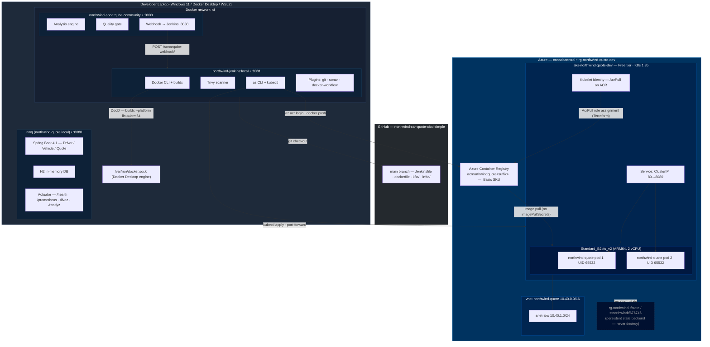

*Full diagram with design decision notes: [docs/architecture-structural.md](./docs/architecture-structural.md)*

### Pipeline flow

```
Checkout → Build & Test → SonarQube Analysis → Quality Gate → Docker Build → Trivy Scan
         → Push to ACR → Deploy to AKS → Smoke Check
```

Each stage gates the next. The three CD stages (Push to ACR, Deploy to AKS, Smoke Check)
are gated behind a `DEPLOY_ENABLED` pipeline parameter so the CI half runs standalone
against the free local stack, and the full 9-stage run fires only when infra is
provisioned.

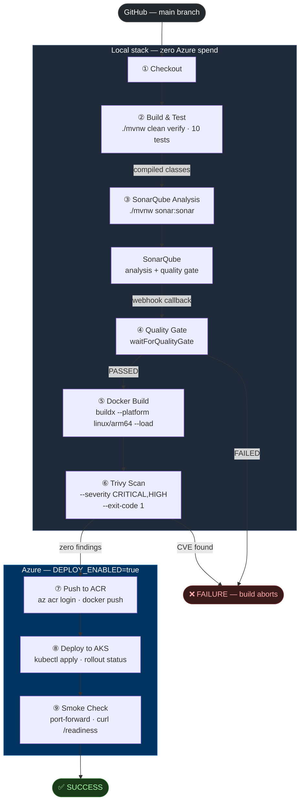

*Full diagram with stage-by-stage reference table and auth model: [docs/architecture-pipeline.md](./docs/architecture-pipeline.md)*

---

## Repository structure

```
/src                  # Spring Boot app source (Driver / Vehicle / Quote domain)
/tools
  docker-compose.yml  # local CI stack: Jenkins + SonarQube
  /jenkins
    dockerfile        # custom Jenkins controller image (Docker CLI + buildx, Trivy, az CLI, kubectl, plugins)
/k8s
  deployment.yaml     # AKS Deployment: 2 replicas, liveness/readiness probes, no imagePullSecrets
  service.yaml        # ClusterIP Service (port-forward only for this phase)
/infra
  /modules
    /network          # reusable: subnet for AKS node pool
    /registry         # reusable: Azure Container Registry (Basic SKU)
    /aks              # reusable: AKS cluster (ARM64 node pool, SystemAssigned identity, kubelet identity output)
  /environments
    /dev              # composes the three modules; ACR+AKS+AcrPull role assignment
dockerfile            # multi-stage app image (build → extract → runtime, ARM64 via --platform cross-build)
Jenkinsfile           # CI/CD pipeline definition (9 stages, DEPLOY_ENABLED param gates CD half)
.trivyignore          # CVE-2026-2100 (p11-kit) suppressed — see "Problems found and fixed" #9
/docs                 # architecture diagrams, screenshot inventory
```

---

## The build, from first line of code to running pod

### Step 1 — The app

The application is built on a **PetClinic structural skeleton** (Spring Boot + Thymeleaf +
Spring Data JPA), with the domain fully replaced: `Driver`, `Vehicle`, `Quote`. A
transparent `QuoteCalculationService` multiplies five independent rating factors (driver
age and experience, vehicle age, usage type, liability limit, deductible) against an $800
base rate. Every intermediate factor is stored on the `Quote` so the result page shows a
full breakdown — not a single opaque number.

The UI uses **Bootstrap 5 + Bootstrap Icons** (via WebJars) with a navy Northwind theme.
The form below takes driver and vehicle details, then calculates and displays the quote
with the complete rating-factor breakdown on the next screen.


### Step 2 — Unit tests

Before any pipeline was wired up, the rating logic was covered by 10 unit tests targeting
`QuoteCalculationService` directly — one test per factor combination edge case. All 10
pass cleanly with `./mvnw test`, giving the pipeline a reliable gate to enforce from the
first run.


### Step 3 — Actuator health endpoints

Actuator was configured to expose `/health`, `/info`, and `/prometheus`, with the
dedicated Kubernetes probe paths `/livez` and `/readyz` enabled ahead of the AKS phase.
This meant the liveness and readiness probes in `k8s/deployment.yaml` were wired to
endpoints that were already proven to work locally — not added as an afterthought once
the cluster existed.

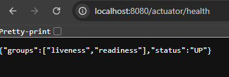

### Step 4 — Local CI stack: Jenkins and SonarQube

Jenkins and SonarQube run as containers on the laptop via `tools/docker-compose.yml`, on
a shared `ci` Docker network. Jenkins uses a custom image (`tools/jenkins/dockerfile`)
that bakes in Docker CLI, the buildx plugin, Trivy, Azure CLI, kubectl, and all required
plugins — so there is no manual plugin installation after first boot.

The Jenkins dashboard below shows both pipeline jobs: `northwind-quote-ci` (the CI-only
run used during development) and `northwind-quote` (the full 9-stage CI/CD run with
`DEPLOY_ENABLED`).


SonarQube stores project analysis history, quality gate results, and code metrics across
runs. The project was configured with the default quality gate (no new bugs, no new
vulnerabilities, coverage threshold) and a webhook back to Jenkins so the Quality Gate
stage could block on the result in real time.


### Step 5 — SonarQube analysis and quality gate

The SonarQube Analysis stage runs `./mvnw sonar:sonar` inside `withSonarQubeEnv`, reusing
the classes already compiled in the Build & Test stage. The Quality Gate stage then blocks
on SonarQube's webhook callback — if the gate isn't green, the build aborts before a
Docker image is ever built. The gate passed on the first clean run.


The exact SonarQube version running in this stack was confirmed via the API rather than
assumed — a habit carried from the handoff document's explicit "no guessing on tool
versions" rule.

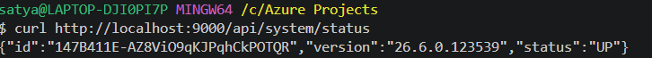

### Step 6 — Docker build and Trivy scan

After the quality gate passes, the Docker Build stage cross-compiles the image for
`linux/arm64` using `docker buildx build --platform linux/arm64 --load`. This is required
because the Jenkins agent runs on an `x86_64` host but the AKS node pool uses
`Standard_B2pls_v2` (ARM64/Ampere) — the only 2-vCPU VM family available without
restrictions on this subscription. The Trivy Scan stage then runs
`trivy image --severity CRITICAL,HIGH --exit-code 1` against the built image, failing the
build on any unaddressed finding.

The scan below shows zero CRITICAL or HIGH findings — the one known finding
(`p11-kit` CVE-2026-2100) is suppressed in `.trivyignore` with a documented rationale
(see problem #9).


### Step 7 — Infrastructure provisioned with Terraform

With CI proven and stable, the Azure infrastructure was provisioned using modular
Terraform: three reusable modules (`network`, `registry`, `aks`) composed by
`infra/environments/dev`. The AKS cluster's kubelet identity is granted `AcrPull` on the
registry via an explicit `azurerm_role_assignment` — the Terraform-native equivalent of
`az aks update --attach-acr` — so no `imagePullSecrets` are needed in the manifests.

`terraform apply` created 7 resources in a single run: resource group, VNet, AKS subnet,
ACR (Basic SKU), AKS cluster (1 node, `Standard_B2pls_v2`, Free tier), the AcrPull role
assignment, and a random suffix for the globally-unique ACR name.

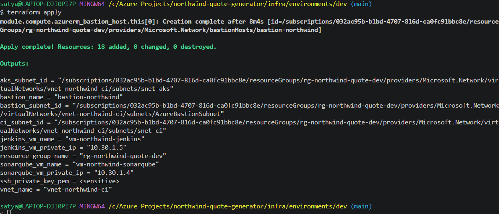

The Portal view below confirms all seven resources provisioned inside `rg-northwind-quote-dev`,
exactly matching the Terraform plan.

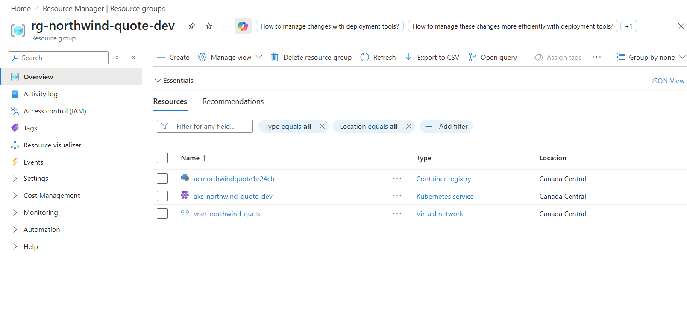

The ACR overview shows the registry name, login server URL, and Basic SKU — admin access
is disabled; the AKS kubelet identity pulls images via the role assignment instead.

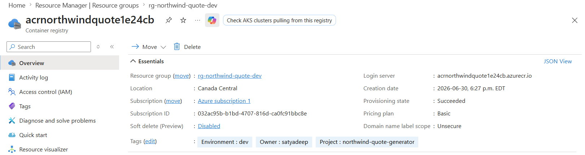

### Step 8 — Full CI/CD pipeline run end to end

With infra up, the `northwind-quote` pipeline was triggered with `DEPLOY_ENABLED=true`.
All 9 stages ran in sequence: the CI half (Checkout → Build & Test → SonarQube Analysis →
Quality Gate → Docker Build → Trivy Scan) completed cleanly, then the CD half pushed the
ARM64 image to ACR, applied the Kubernetes manifests to AKS, waited for the rollout to
complete, and confirmed the app was answering traffic via a port-forward smoke check.


The JUnit results from the Build & Test stage are published to Jenkins after every run,
regardless of outcome, so test trends are visible over time. All 10 tests passed.

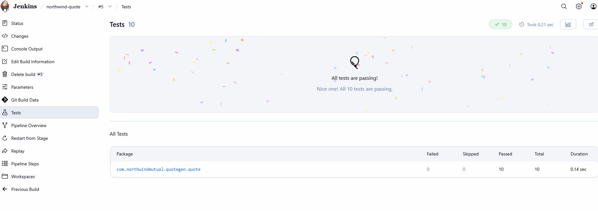

### Step 9 — Image in ACR, pods running on AKS

After the Push to ACR stage completed, the build-numbered image tag was confirmed in the
registry. The Deploy to AKS stage then applied `k8s/service.yaml` and
`k8s/deployment.yaml` (with the image tag substituted in at deploy time), and waited on
`kubectl rollout status` to confirm both replicas were up before proceeding.

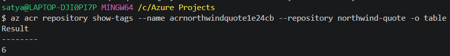

`kubectl get pods` confirms both pods reached `Running` status with zero restarts — the
ARM64 image executed correctly on the ARM64 node, with the `HEALTHCHECK` passing and the
readiness probe confirming the app was accepting traffic.

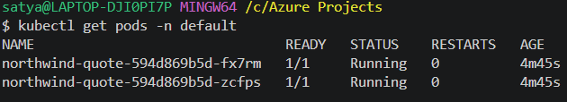

The Smoke Check stage port-forwarded the ClusterIP service and curled
`/actuator/health/readiness` directly, confirming the newly-deployed pods were answering
real HTTP traffic — not just that Kubernetes considered them healthy.

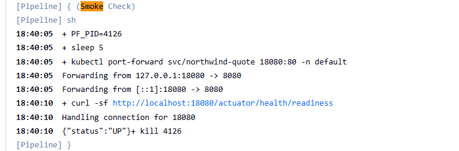

The Portal view below shows the Deployment from AKS's own perspective — 2/2 replicas
available, matching what `kubectl` reported.

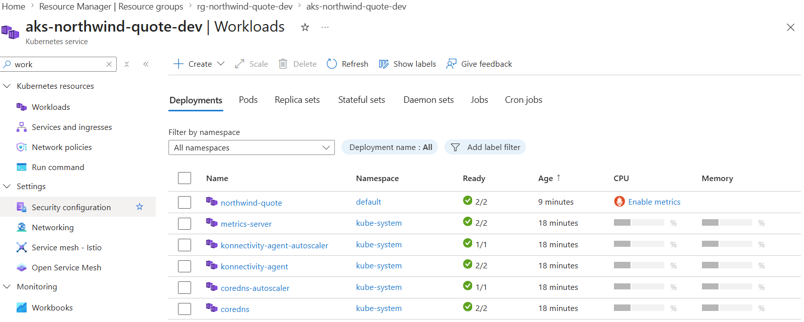

### Step 10 — Infra torn down

Per the project's cost discipline, the dev infrastructure is destroyed at the end of
every session. `terraform destroy` removed all 7 resources cleanly, and `az group list`
confirmed `rg-northwind-quote-dev` was gone — only the persistent state backend
(`rg-northwind-tfstate`) remained.

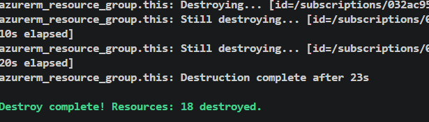

---

## Problems found and fixed

Each of these is a genuine bug hit during this project, not a hypothetical — included
because the diagnosis, not just the fix, is the actual signal.

### 1. i18n resource-bundle fallback was inconsistent

Spring Boot's implicit message-bundle fallback behavior across Spring Boot/JDK
combinations is a known source of inconsistency
([spring-boot#30801](https://github.com/spring-projects/spring-boot/issues/30801)). Rather
than rely on it, the fix was to ship an explicit `messages_en.properties` alongside the
base `messages.properties`, set `spring.messages.basename=messages/messages` explicitly,
and disable system-locale fallback (`spring.messages.fallback-to-system-locale=false`). The
result: `en`/`en_CA`/`en_US` all resolve predictably without depending on implicit
behavior.

### 2. `NULL not allowed for DRIVER_ID`

Saving a `Vehicle` failed with a not-null constraint violation on `DRIVER_ID`. The
relationship between `Driver` and `Vehicle` wasn't being persisted from both sides — JPA's
`@ManyToOne` association needs the owning side set explicitly, so the fix made the
Driver↔Vehicle relationship genuinely bidirectional, with the `Vehicle` side responsible
for setting its `Driver` reference before save.

### 3. Trivy CVE finding in the base image (`p11-kit` CVE-2026-2100)

The first Trivy scan against the runtime image surfaced a HIGH-severity finding in
`p11-kit`, a package that ships with Alpine but wasn't yet patched in the
`eclipse-temurin:21-jre-alpine` base image as published. The fix exists in Alpine's
package repos (`0.26.2-r0`) but can't be applied via `apk upgrade` at cross-build time
because QEMU emulation prevents executing Alpine binaries on this host (see problem #9).
The finding is suppressed in `.trivyignore` with a documented rationale and will be
removed once the upstream base image ships the patched package.

### 4. Layered JAR extraction needs the `JarLauncher` entrypoint

After switching the Docker build to Spring Boot's layered-extraction format (for better
layer caching), the obvious `ENTRYPOINT ["java", "-jar", "app.jar"]` no longer works —
there is no single `app.jar` after extraction, just a directory of layers. The fix:
`ENTRYPOINT ["java", "org.springframework.boot.loader.launch.JarLauncher"]`, which is
exactly what the extracted layers are structured for.

### 5. Jenkins couldn't reach the Docker socket (Docker Desktop / WSL2)

DooD builds failed with a permission error against the mounted `/var/run/docker.sock`.
The fix is `group_add: ["0"]` on the Jenkins service in `docker-compose.yml` — adding the
Jenkins container process to the root group, which on Docker Desktop's WSL2 backend owns
the socket. A user-level `usermod -aG docker jenkins`-style fix inside the image does
**not** work here, because the socket's owning GID inside Docker Desktop's WSL2 VM doesn't
match any group baked into the image at build time.

### 6. SonarQube quality gate hung at `PENDING`

The Quality Gate stage timed out waiting for a webhook callback that never arrived.
SonarQube only calls back to Jenkins if a webhook is explicitly configured — the fix was
creating one in SonarQube pointed at `http://jenkins:8080/sonarqube-webhook/` (the
container's internal hostname/port on the shared `ci` network, not the host-mapped
`8081`). Once configured, the gate result returns within seconds of analysis completing.

### 7. Azure CLI apt repo has no Debian Trixie release

`jenkins/jenkins:lts-jdk21` runs Debian Trixie (the current testing branch). Microsoft's
Azure CLI apt repository only publishes releases for named stable Debian codenames
(bookworm, bullseye). The `$VERSION_CODENAME` shell expansion inside the Dockerfile
resolved to `trixie`, which produced a 404 from Microsoft's package server and a build
failure. The fix: pin the apt source line to `bookworm` explicitly rather than letting
`$VERSION_CODENAME` resolve dynamically. This installs az CLI 2.87.0 cleanly from
the bookworm release, which is ABI-compatible with Trixie.

### 8. ARM64 image crash-loops with `exec format error`

The AKS node pool uses `Standard_B2pls_v2` (ARM64/Ampere). The Jenkins build agent runs
on `x86_64` Docker Desktop. A plain `docker build` produces an `amd64` image — which AKS
successfully schedules (image pulled fine via the AcrPull managed identity) but
immediately crash-loops every pod with `exec format error` when the kubelet tries to run
the `java` binary for the wrong architecture. Fix: switch to
`docker buildx build --platform linux/arm64 --load`, and add `docker-buildx-plugin` to
the Jenkins image (not included in `docker-ce-cli` alone).

### 9. QEMU can't execute Alpine binaries during ARM64 cross-build (`apk upgrade`, `adduser`)

After switching to `--platform linux/arm64`, the Dockerfile's `RUN apk upgrade` and
`RUN adduser` steps in the runtime stage failed with `exec format error` during the
*build* — not at container start. Docker Desktop registers `linux/arm64` as a supported
buildx platform, but the QEMU emulation it provides via DooD cannot actually execute
Alpine/musl `sh` or `apk`. Fix: add `--platform=$BUILDPLATFORM` to the build and extract
stages so they run natively on `amd64`, and eliminate all `RUN` steps from the runtime
stage. Non-root is achieved with `USER 65532` (a numeric UID, no `adduser` needed).

---

## Cost-conscious design

- **Zero Azure spend until the CD phase.** The entire CI loop — build, test, Sonar,
  Docker build, Trivy scan — runs on free local Docker containers. No Azure resources
  were provisioned until every stage was proven locally first.
- **Infra is torn down between sessions.** `terraform destroy` removes all 7 dev
  resources at the end of every session; the next session starts with `terraform apply`
  from the persistent state backend (`rg-northwind-tfstate`). `az group list` is run
  before ending a session to confirm nothing was left running.
- **Cost-aware sizing.** AKS uses the Free tier SKU and a single `Standard_B2pls_v2`
  node (2 vCPUs, ARM64) — the smallest confirmed-available size on this subscription in
  `canadacentral`. The x86 burstable family is blocked on this subscription; ARM64 is
  the only available option at this size, which also drove the cross-compilation work in
  problems 8 and 9.
- **No redundant state backend.** The Terraform state backend (`rg-northwind-tfstate`) is
  shared across portfolio projects rather than creating a new storage account per project.

---

## On the horizon

Phase 7 (ACR + AKS Terraform, CD pipeline, end-to-end deploy) is complete. Remaining:

1. **AKS hardening** — HPA, NetworkPolicy, Ingress + TLS, replacing the current
   ClusterIP + port-forward exposure. Node pool currently 1 node (`Standard_B2pls_v2`)
   due to this subscription's 4-vCPU regional quota; a 2-node pool requires a quota
   increase.
2. **Key Vault** for the SonarQube token and any other secrets, with Jenkins granted a
   managed identity with least-privilege vault access — replacing the service-principal
   credential (`azure-sp`) the CD stages currently use.
3. **Monitoring/alerting** — Container Insights / Azure Monitor, with at least one real
   alert rule.

**Deliberately deferred** (documented, not built): VNet peering between the CI and AKS
networks, image signing/SBOM generation, multi-environment AKS, Front Door/WAF in front
of the Ingress.

---

## Running it locally

```bash
# App only
./mvnw spring-boot:run
# → http://localhost:8080

# Full CI stack (Jenkins + SonarQube)
docker compose -f tools/docker-compose.yml up -d --build
# Jenkins → http://localhost:8081
# SonarQube → http://localhost:9000
```

`JAVA_HOME` must point at a JDK 17+ install (the build enforces this via
`maven-enforcer-plugin`). No system Maven is required — everything goes through the
`./mvnw` wrapper.
