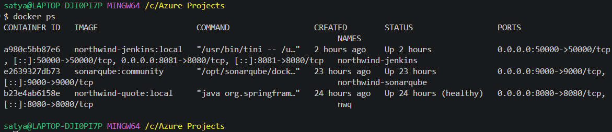

# Northwind Mutual — Car Quote Generator (CI/CD with Jenkins)

A Java Spring Boot car-insurance quote application, built and quality-gated by a
**self-hosted Jenkins pipeline**: Checkout → Maven build/test → SonarQube analysis +
quality gate → Docker build → Trivy vulnerability scan. Deploying that scanned image to
AKS is the next phase of this project — see [On the horizon](#on-the-horizon).

> **Disclaimer:** "Northwind Mutual" is a fictional company. All code, infrastructure,
> and data in this project are for personal learning purposes only and do not represent
> or use any real systems, data, or processes from any actual insurance company or
> employer.

---

## What this project demonstrates

Projects 1–3 in this portfolio use Azure DevOps Pipelines, a managed CI/CD service.
This project deliberately uses **Jenkins** instead — a self-hosted CI server you install,
configure, patch, and operate yourself. That's a different skill: instead of trusting a
managed control plane, you're responsible for the controller's plugins, its Docker socket
access, its credentials, and its integration with a second self-hosted tool (SonarQube).

The app itself is a small, honest insurance-domain exercise: driver → vehicle → coverage
choice → calculated premium, with every rating factor visible on the result page rather
than a single opaque number. The interesting engineering is in the pipeline around it —
proving a real build-test-scan loop works **before** any of it touches billable Azure
infrastructure.

### Methodology: manual first, then automate

Every stage in the Jenkinsfile was run by hand first — `./mvnw clean verify` at a
terminal, a manual `docker build`, a manual `trivy image` scan — before it was wired into
Jenkins. That order matters: when a pipeline stage fails, you want to already know what
success looks like from having done it manually, so you can tell a real bug from a CI
environment problem in seconds instead of guessing.

### Project status

The app layer and the CI half of the pipeline (build through image scan) are complete and
verified, running entirely on free, local Docker containers — zero Azure spend so far.
The CD half (push to ACR, deploy to AKS) is the next phase; see
[On the horizon](#on-the-horizon).

---

## Architecture

### Structural view

Three containers on one Docker network: the app itself, the Jenkins controller, and
SonarQube. Jenkins builds Docker images via **Docker-outside-of-Docker (DooD)** — it
doesn't run its own Docker daemon, it talks to the host's Docker Desktop engine through a
mounted socket. This keeps the whole stack runnable on a laptop with no cloud dependency
during development.


<!-- TODO: draw.io export — app/Jenkins/SonarQube containers, ci network, host port mappings 8080/8081/9000, DooD socket mount -->

### Pipeline flow

```
Checkout → Build & Test → SonarQube Analysis → Quality Gate → Docker Build → Trivy Scan
```

Each stage gates the next: tests must pass before Sonar analysis runs, the quality gate
must pass before an image is built, and the image must scan clean before the pipeline
reports success. ACR push and AKS deploy stages are not yet in the Jenkinsfile — the
pipeline currently stops at "image built and scanned," proving the entire build-quality
half with zero Azure spend.


<!-- TODO: draw.io export — six pipeline stages, what each produces/consumes, gate points -->

---

## Resource list

Everything in this phase runs locally — there is no billable Azure infrastructure yet.

| Component | Image / Tool | Host port | Notes |
|---|---|---|---|
| App | `northwind-quote:local` (this repo's `dockerfile`) | `8080` | Spring Boot, H2 in-memory DB, Actuator health/info/prometheus exposed |
| Jenkins | `northwind-jenkins:local` (`tools/jenkins/dockerfile`, based on `jenkins/jenkins:lts-jdk21`) | `8081` (UI), `50000` (agent, unused) | Docker CLI + Trivy baked in; plugins pre-installed via `jenkins-plugin-cli` |
| SonarQube | `sonarqube:community` | `9000` | Code quality analysis + quality gate, webhooks back to Jenkins |

All three are defined in [`tools/docker-compose.yml`](./tools/docker-compose.yml) on a
shared `ci` Docker network, with named volumes (`jenkins_home`, `sonarqube_data`,
`sonarqube_extensions`, `sonarqube_logs`) persisting state across container restarts.

---

## Repository structure

```
/src                  # Spring Boot app source (Driver / Vehicle / Quote domain)
/tools
  docker-compose.yml  # local CI stack: Jenkins + SonarQube
  /jenkins
    dockerfile        # custom Jenkins controller image (Docker CLI, Trivy, az CLI, kubectl, plugins)
/k8s
  deployment.yaml     # AKS Deployment: 2 replicas, liveness/readiness probes, no imagePullSecrets
  service.yaml        # ClusterIP Service (port-forward only — no public endpoint yet)
dockerfile            # multi-stage app image (build → extract → runtime)
Jenkinsfile            # CI/CD pipeline definition
/docs                 # architecture diagrams, screenshot inventory
```

No Terraform exists yet in this repo — infrastructure-as-code is introduced in
[Phase 7](#on-the-horizon) when ACR and AKS are provisioned.

---

## The app

Built on a **PetClinic structural skeleton** (Spring Boot + Thymeleaf + Spring Data JPA),
with the entire domain swapped from pets/owners to car insurance: `Driver`, `Vehicle`,
`Quote`, with a transparent `QuoteCalculationService` that multiplies five independent
rating factors (driver age/experience, vehicle age, usage type, liability limit,
deductible) against an $800 base rate. The calculation is intentionally illustrative
rather than actuarially accurate — the goal is a formula a reader can follow end-to-end,
with every intermediate factor stored on the resulting `Quote` so the UI can show a full
breakdown instead of a single number.

UI is real **Bootstrap 5 + Bootstrap Icons** (via WebJars), navy Northwind theme. 10 unit
tests cover the rating logic; `./mvnw test` passes 10/10. Actuator exposes
`health`/`info`/`prometheus`, with `/livez` and `/readyz` probe groups already enabled
(`management.endpoint.health.probes.add-additional-paths=true`) — wired in ahead of time
for the AKS liveness/readiness probes planned in Phase 8.


<!-- TODO: capture -->


<!-- TODO: capture -->


<!-- TODO: capture -->


<!-- TODO: capture -->

---

## Dockerfile

Three-stage build (`./dockerfile`):

1. **Build** — `maven:3.9-eclipse-temurin-21`, runs the Maven wrapper to produce the fat
   JAR. The `.mvn`/`mvnw`/`pom.xml` layer is copied and `dependency:go-offline` run before
   source is copied, so dependency resolution is cached separately from application code.
2. **Extract** — `eclipse-temurin:21-jre`, unpacks the fat JAR into Spring Boot's
   **layered** format (`-Djarmode=tools ... extract --layers --launcher`), so Docker can
   cache rarely-changing dependency layers separately from frequently-changing application
   classes.
3. **Runtime** — `eclipse-temurin:21-jre-alpine`, JRE-only (no compiler, smaller attack
   surface), runs as a non-root user `northwind`, container-aware heap sizing via
   `-XX:+UseContainerSupport -XX:MaxRAMPercentage=75.0`, and a `HEALTHCHECK` against
   `/actuator/health`.

Tests are deliberately **not** re-run inside the image build (`-DskipTests`) — they run
once, as a dedicated Jenkins stage where results are reported and the Sonar quality gate
is evaluated against them. Re-running them inside the image build would duplicate work
without adding signal.

---

## CI/CD pipeline

### Stages

| Stage | What it does |
|---|---|
| **Checkout** | `checkout scm` — explicit in logs even though Jenkins auto-checks-out for "Pipeline script from SCM" jobs |
| **Build & Test** | `./mvnw -B clean verify` — compiles, runs all 10 unit tests, packages the JAR; JUnit results published to Jenkins regardless of outcome |
| **SonarQube Analysis** | `./mvnw -B sonar:sonar` inside `withSonarQubeEnv('SonarQube')`, reusing the already-compiled classes from the previous stage |
| **Quality Gate** | `waitForQualityGate abortPipeline: true` — blocks on SonarQube's webhook callback (5-minute timeout), fails the build if the gate isn't green |
| **Docker Build** | `docker build` against the host engine via the mounted socket (DooD), tags `<build-number>` and `latest` |
| **Trivy Scan** | `trivy image --severity CRITICAL,HIGH --exit-code 1` — fails the build on any CRITICAL/HIGH finding |
| **Push to ACR** *(gated)* | `az acr login` + `docker push`, tags `<acr>.azurecr.io/northwind-quote:<build-number>` |
| **Deploy to AKS** *(gated)* | `az aks get-credentials` then `kubectl apply` of `k8s/service.yaml` and `k8s/deployment.yaml` (image tag substituted in), waits on `kubectl rollout status` |
| **Smoke Check** *(gated)* | Port-forwards the new Service and curls `/actuator/health/readiness`, confirming the rollout actually answers traffic, not just that Kubernetes reports it healthy |

The three *(gated)* stages are written and present in the Jenkinsfile now but skipped
unless the `DEPLOY_ENABLED` pipeline parameter is set to `true` — there is no ACR or AKS
to deploy to yet (see [On the horizon](#on-the-horizon)). Writing them ahead of the
infrastructure means the CD logic is reviewed and ready to flip on the moment Phase 7
exists, rather than written under pressure once billable resources are already running.

Pipeline options: `timestamps()`, a 30-minute overall timeout, and
`disableConcurrentBuilds()` so overlapping runs can't race each other.


<!-- TODO: capture -->


<!-- TODO: capture -->


<!-- TODO: capture -->

### Local CI stack

Jenkins and SonarQube run as containers on this laptop (`tools/docker-compose.yml`), not
on Azure infrastructure — see [Cost-conscious design](#cost-conscious-design). Start with:

```bash
docker compose -f tools/docker-compose.yml up -d --build
```


<!-- TODO: capture -->


<!-- TODO: capture -->


<!-- TODO: capture -->

---

## Problems found and fixed

Each of these is a genuine bug hit during this project, not a hypothetical — included
because the diagnosis, not just the fix, is the actual signal.

### 1. i18n resource-bundle fallback was inconsistent

Spring Boot's implicit message-bundle fallback behavior across Spring Boot/JDK
combinations is a known source of inconsistency
([spring-boot#30801](https://github.com/spring-projects/spring-boot/issues/30801)). Rather
than rely on it, the fix was to ship an explicit `messages_en.properties` alongside the
base `messages.properties`, set `spring.messages.basename=messages/messages` explicitly,
and disable system-locale fallback (`spring.messages.fallback-to-system-locale=false`). The
result: `en`/`en_CA`/`en_US` all resolve predictably without depending on implicit
behavior.


<!-- TODO: capture -->


<!-- TODO: capture -->

### 2. `NULL not allowed for DRIVER_ID`

Saving a `Vehicle` failed with a not-null constraint violation on `DRIVER_ID`. The
relationship between `Driver` and `Vehicle` wasn't being persisted from both sides — JPA's
`@ManyToOne` association needs the owning side set explicitly, so the fix made the
Driver↔Vehicle relationship genuinely bidirectional, with the `Vehicle` side responsible
for setting its `Driver` reference before save.


<!-- TODO: capture -->


<!-- TODO: capture -->

### 3. Trivy CVE finding in the base image (`p11-kit` CVE-2026-2100)

The first Trivy scan against the runtime image surfaced a HIGH-severity finding in
`p11-kit`, a package that ships with Alpine but wasn't yet patched in the
`eclipse-temurin:21-jre-alpine` base image as published. Rather than suppress or ignore
the finding, the runtime stage now runs `apk upgrade --no-cache` at build time, picking up
whatever OS security fixes have landed in Alpine's package repos since the base image was
published — keeping the Trivy gate green without weakening it.


<!-- TODO: capture -->


<!-- TODO: capture -->

### 4. Layered JAR extraction needs the `JarLauncher` entrypoint

After switching the Docker build to Spring Boot's layered-extraction format (for better
layer caching), the obvious `ENTRYPOINT ["java", "-jar", "app.jar"]` no longer works —
there is no single `app.jar` after extraction, just a directory of layers. The fix:
`ENTRYPOINT ["java", "org.springframework.boot.loader.launch.JarLauncher"]`, which is
exactly what the extracted layers are structured for.


<!-- TODO: capture -->


<!-- TODO: capture -->

### 5. Jenkins couldn't reach the Docker socket (Docker Desktop / WSL2)

DooD builds failed with a permission error against the mounted `/var/run/docker.sock`.
The fix is `group_add: ["0"]` on the Jenkins service in `docker-compose.yml` — adding the
Jenkins container process to the root group, which on Docker Desktop's WSL2 backend owns
the socket. A user-level `usermod -aG docker jenkins`-style fix inside the image does
**not** work here, because the socket's owning GID inside Docker Desktop's WSL2 VM doesn't
match any group baked into the image at build time.


<!-- TODO: capture -->

### 6. SonarQube quality gate hung at `PENDING`

The Quality Gate stage timed out waiting for a webhook callback that never arrived.
SonarQube only calls back to Jenkins if a webhook is explicitly configured — the fix was
creating one in SonarQube pointed at `http://jenkins:8080/sonarqube-webhook/` (the
container's internal hostname/port on the shared `ci` network, not the host-mapped
`8081`). Once configured, the gate result returns within seconds of analysis completing.


<!-- TODO: capture -->


<!-- TODO: capture -->

---

## Cost-conscious design

- **Everything in this phase runs locally.** Jenkins and SonarQube are Docker containers
  on a laptop, not Azure VMs — the entire build-test-scan loop is proven at zero Azure
  spend before any billable infrastructure is provisioned.
- **Manual-first methodology** (see [above](#methodology-manual-first-then-automate))
  catches configuration mistakes before they become a paid pipeline run, not after.
- When AKS/ACR are introduced in Phase 7, the plan is to **destroy infra between
  sessions** against the persistent Terraform state backend, confirming the plan's
  resource count before every apply and the empty resource group before ending a session
  — the same discipline used in this portfolio's other projects.

## On the horizon

Not yet built, in rough order:

1. **Phase 7 — ACR + AKS Terraform module**, the first new billable infrastructure in
   this project. The CD half of the Jenkinsfile (`k8s/deployment.yaml`,
   `k8s/service.yaml`, the Push to ACR / Deploy to AKS / Smoke Check stages) is already
   written and gated behind a `DEPLOY_ENABLED` parameter — this phase is what flips it
   on. Decided ahead of provisioning: AKS pulls from ACR via its kubelet managed
   identity (`az aks update --attach-acr`, AcrPull role), not `imagePullSecrets`; the app
   is exposed via `ClusterIP` + port-forward only, no LoadBalancer/Ingress yet.
2. **AKS hardening** — resource requests/limits (already set in `k8s/deployment.yaml`),
   HPA, NetworkPolicy, Ingress + TLS, replacing the current port-forward-only exposure.
3. **Key Vault** for the SonarQube token and any other secrets, with Jenkins granted a
   managed identity with least-privilege vault access — replacing the service-principal
   credential the CD stages currently assume.
4. **Monitoring/alerting** — Container Insights / Azure Monitor, with at least one real
   alert rule.

**Deliberately deferred** (documented, not built): VNet peering between the CI and AKS
networks, image signing/SBOM generation, multi-environment AKS, Front Door/WAF in front
of the Ingress.

---

## Running it locally

```bash
# App only
./mvnw spring-boot:run
# → http://localhost:8080

# Full CI stack (Jenkins + SonarQube)
docker compose -f tools/docker-compose.yml up -d --build
# Jenkins → http://localhost:8081
# SonarQube → http://localhost:9000
```

`JAVA_HOME` must point at a JDK 17+ install (the build enforces this via
`maven-enforcer-plugin`). No system Maven is required — everything goes through the
`./mvnw` wrapper.
