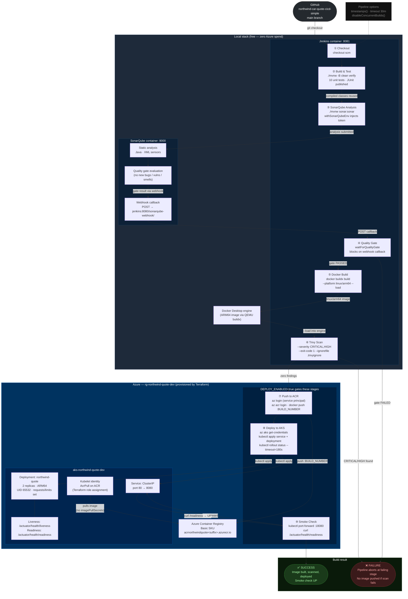

# Pipeline Architecture — Northwind Mutual Car Quote Generator



## Stage-by-stage reference

| # | Stage | Runs when | Key mechanism | Fails build if |
|---|---|---|---|---|
| ① | Checkout | Always | `checkout scm` from GitHub `main` | Repo unreachable |
| ② | Build & Test | Always | `./mvnw -B clean verify` · JUnit published via `post { always }` | Any unit test fails |
| ③ | SonarQube Analysis | Always | `withSonarQubeEnv` injects `SONAR_HOST_URL` + token; reuses compiled classes | Sonar server unreachable |
| ④ | Quality Gate | Always | `waitForQualityGate abortPipeline: true` · 5-min timeout · webhook-driven | Gate status not `OK` |
| ⑤ | Docker Build | Always | `docker buildx build --platform linux/arm64 --load` via DooD socket | Build error |
| ⑥ | Trivy Scan | Always | `--severity CRITICAL,HIGH --exit-code 1 --ignorefile .trivyignore` | Any unignored CRITICAL/HIGH CVE |
| ⑦ | Push to ACR | `DEPLOY_ENABLED=true` | SP login → `az acr login` → `docker push :<BUILD_NUMBER>` | Auth failure or push error |
| ⑧ | Deploy to AKS | `DEPLOY_ENABLED=true` | `kubectl apply` + `rollout status --timeout=180s` | Rollout doesn't complete in 3 min |
| ⑨ | Smoke Check | `DEPLOY_ENABLED=true` | `kubectl port-forward` → `curl /actuator/health/readiness` | Readiness endpoint not `UP` |

## Authentication model

```
Jenkins SP (azure-sp credential)
  ├── AcrPush on ACR          → stages ⑦ (image push)
  └── AKS Cluster User Role   → stage  ⑧ (get-credentials)

AKS kubelet identity (Terraform azurerm_role_assignment)
  └── AcrPull on ACR          → node pulls image (no imagePullSecrets in manifests)
```
