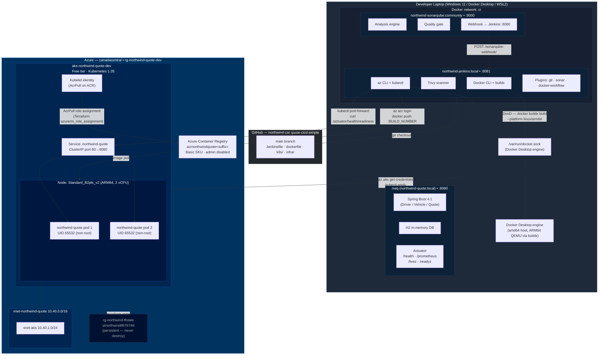

# Structural Architecture — Northwind Mutual Car Quote Generator

## Key design decisions shown above

| Decision | Why |
|---|---|
| DooD (socket mount) not DinD | No nested daemon; Jenkins uses the host Docker Desktop engine directly |
| `--platform linux/arm64` via buildx | AKS node pool is ARM64 (`Standard_B2pls_v2`); build agent is amd64 — QEMU cross-compilation bridges the gap |
| `USER 65532` not `adduser` | All `RUN` steps removed from the ARM64 runtime stage to avoid QEMU emulation failures during build |
| AcrPull via kubelet identity | `azurerm_role_assignment` in Terraform — no `imagePullSecrets`, no credential rotation |
| ClusterIP only | No public endpoint yet; smoke check uses `kubectl port-forward` — LoadBalancer/Ingress deferred to hardening phase |
| Persistent state backend separate RG | `rg-northwind-tfstate` never destroyed; `rg-northwind-quote-dev` torn down between sessions |
